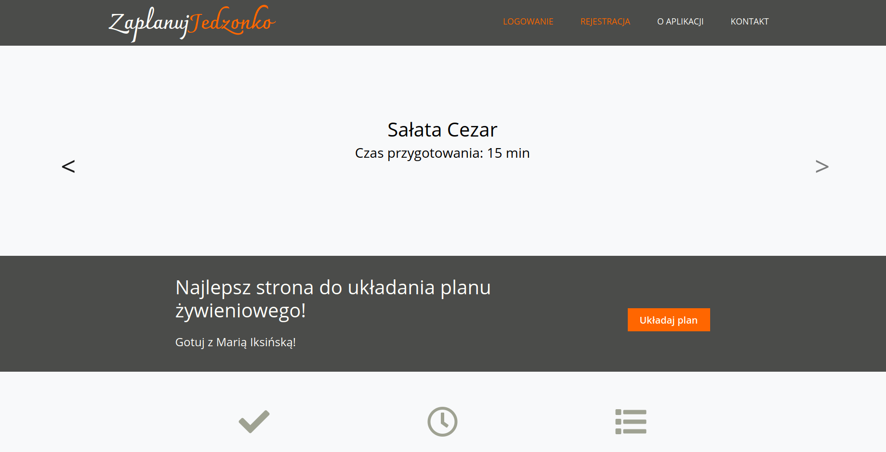
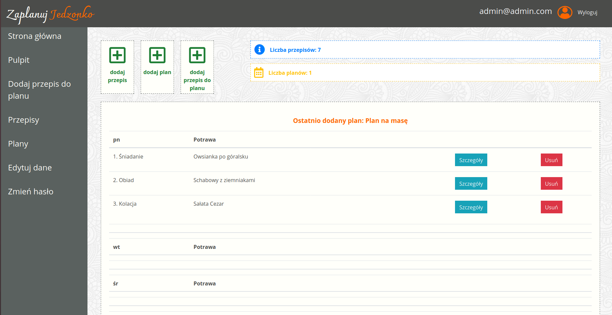
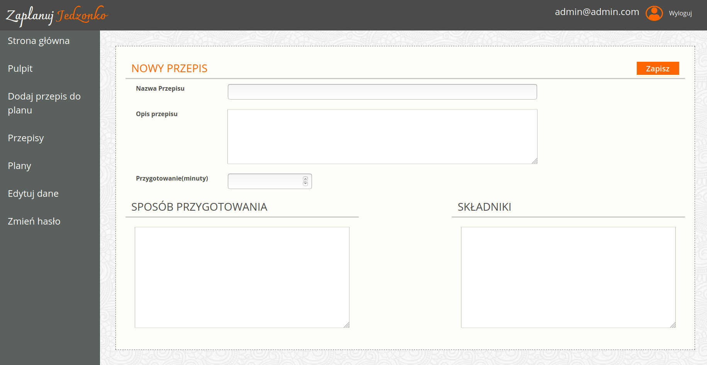
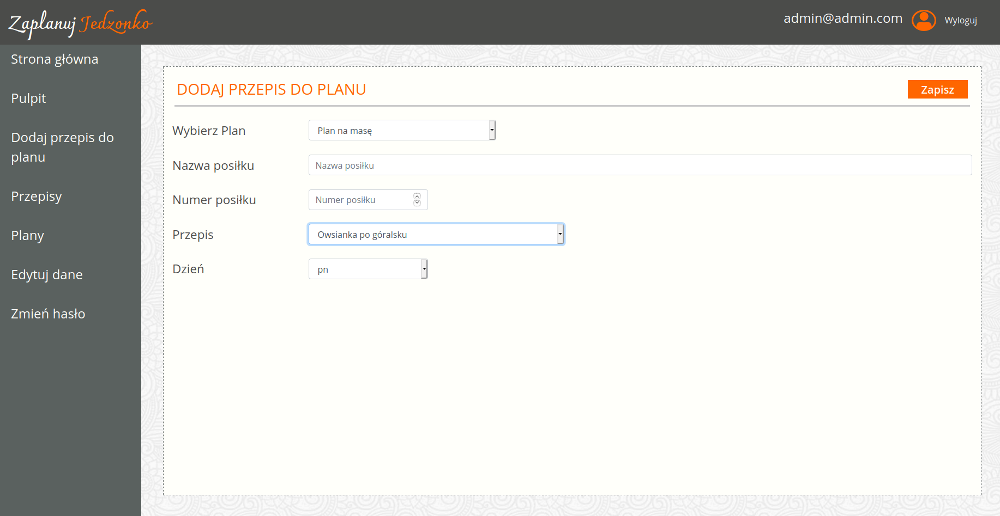

# MEAL ORGANIZER

Django app for you to organize your meals. You will be able make plans and add recipes of your favourite meals.

## Visuals

#### Landing page

Navbar contains registration and login links. Underneath is slider with dynamic data loaded.

#### Dashboard

After login user is redirect to dashboard. There is placed last plan added with its recipes and info about how many
plans and recipes user have. Menu goes on the left hand side. 

#### Forms

Recipe add form. User have to specify its name, description, preparation time and rest of needed information.


Add recipe to schedule form. User have to choose which meal goes to which day and in what order. 

## Installation

Use the package manager pip to install requirements.txt.

```bash
pip install requrements.txt
```

**:exclamation: CREATE SUPERUSER :exclamation:**

## Usage

To run a project, first you have to make changes in settings. You can do thins in several ways:
1. Use python_decouple module (safer)
2. Fill up a settings in settings.py (non-confidential data)

- For first method install module.

```bash
pip install python-decouple
```
Then check in your settings.py if you have imported module.

```python
from decouple import config
```
Next in the project you will find `.env.example` file. Rename it to `.env` and fill your data in it.

- For the second method in settings.py replaced
```python
SECRET_KEY = config('SECRET_KEY')
```
to
```python
SECRET_KEY = '#nj&njyte......................'
```
and do this to every changed setting.

It may happend that you will have to add manually from shell or from django admin site some data. Also as superuser you 
will have and extra field to enter to admin.


## Support

If you need any help:

:email: **Email** - *aaa@aaa.com*

:telephone_receiver: **Phone** - *123456789*

## Project status

Project is still in development. Many things will be added soon:
- [ ] Recipes available for every user with rate (recipe database)
- [ ] Share your plans to other users
- [ ] Print yours schedule
- [ ] More advanced profile
